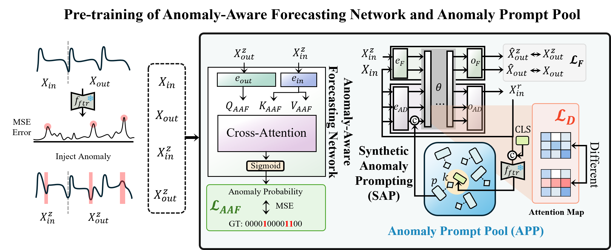

# [ICML 2025] When Will It Fail?: Anomaly to Prompt for Forecasting Future Anomalies in Time Series

Official PyTorch implementation accepted by ICML 2025:

**When Will It Fail?: Anomaly to Prompt for Forecasting Future Anomalies in Time Series**  
Min-Yeong Park*, Won-Jeong Lee*, Seong Tae Kim, and Gyeong-Moon Park

[](https://arxiv.org/abs/2506.23596)  

## Abstract
Recently, forecasting future abnormal events has emerged as an important scenario to tackle real-world necessities. However, the solution of predicting specific future time points when anomalies will occur, known as Anomaly Prediction (AP), remains under-explored. Existing methods dealing with time series data fail in AP, focusing only on immediate anomalies or failing to provide precise predictions for future anomalies. To address the AP task, we propose a novel framework called Anomaly to Prompt (A2P), comprised of Anomaly-Aware Forecasting (AAF) and Synthetic Anomaly Prompting (SAP). To enable the forecasting model to forecast abnormal time points, we adopt a strategy to learn the relationships of anomalies. For the robust detection of anomalies, our proposed SAP introduces a learnable Anomaly Prompt Pool (APP) that simulates diverse anomaly patterns using signal adaptive prompt. Comprehensive experiments on multiple real-world datasets demonstrate the superiority of A2P over state-of-the-art methods, showcasing its ability to predict future anomalies.

## Anomaly to Prompt (A2P)

<p align="center">

## Requirements

    pip install -r requirements.txt

## Run the Anomaly to Prompt (A2P)

    run.sh

# BibTex
```
@InProceedings{pmlr-v267-park25e,
  title = 	 {When Will It Fail?: Anomaly to Prompt for Forecasting Future Anomalies in Time Series},
  author =       {Park, Min-Yeong and Lee, Won-Jeong and Kim, Seong Tae and Park, Gyeong-Moon},
  booktitle = 	 {Proceedings of the 42nd International Conference on Machine Learning},
  pages = 	 {48086–48103},
  year = 	 {2025}
}
```
